# Dynamic CMS Page Generator

A dynamic, AI-powered single-page application (SPA) that generates pages on-demand based on user intent from SleekCMS data. This is NOT a static website generator - it's a dynamic content system with hash-based routing.

## Features

- 🔌 **SleekCMS Integration**: Connect using pub tokens to fetch website data
- 🤖 **AI-Powered Generation**: Uses Claude Haiku to generate beautiful pages on-demand
- 🎨 **Beautiful UI**: Modern Tailwind CSS design with dynamic theme colors
- 📱 **Responsive**: Mobile-first design that works on all screen sizes
- ⚡ **Hash-Based Routing**: Single-page app with no page reloads
- 🎯 **Intent-Based**: AI-calculated intent cards from data structure
- 🎨 **Theme Detection**: Automatic theme color extraction from site data
- 📄 **Detail Pages**: Generate detailed pages for individual items

## How Everything Works - Step by Step

### Phase 1: Initial Connection and Setup

**Step 1: User Opens the Application**
- User visits `http://localhost:3000` in their browser
- The frontend checks if there's a saved session in `localStorage`
- If no session exists, shows the "Connect" screen with a pub token input form

**Step 2: User Enters Pub Token**
- User enters their SleekCMS pub token (e.g., `pub-1ez9p-xyz123`)
- Clicks the "Connect" button
- Frontend sends a POST request to `/api/connect` with the pub token

**Step 3: Backend Fetches Website Data**
- Backend receives the pub token
- `pub-token-fetcher.ts` analyzes the token format
- It tries multiple endpoint combinations:
  - `https://pub.sleekcms.com/{siteId}/latest`
  - Various authentication header formats (Bearer token, PUB_TOKEN, etc.)
- Once successful, it fetches the complete website data JSON from SleekCMS
- This data contains everything: pages, entries, config, navbar, footer, etc.

**Step 4: Backend Extracts Site Information**
- `hero-extractor.ts` extracts:
  - Site title (from navbar logo_text or config.title)
  - Subtitle/tagline (from config, navbar, or hero sections)
  - Hero image (from hero sections, logo, or navbar)
- `theme-extractor.ts` tries to extract theme colors:
  - First attempts manual extraction from config.theme, navbar colors, footer colors
  - If no colors found, falls back to AI detection via `ai-theme-detector.ts`
  - AI analyzes the site data and returns primary, secondary, accent, background, and text colors

**Step 5: Backend Calculates Intent Cards Using AI**
- `ai-intent-calculator.ts` sends the entire site data to Claude AI
- AI analyzes the data structure and thinks from a user's perspective
- AI returns 8-15 intent cards, each with:
  - `id`: Unique identifier (e.g., "find-properties", "view-menu")
  - `title`: User-friendly title (e.g., "Find Your Dream Home")
  - `description`: What the user will discover
  - `icon`: Emoji representing the intent
  - `dataPath`: Path to relevant data (e.g., "entries.properties" or "pages[0].sitesections[1]")

**Step 6: Backend Creates Session**
- Backend creates a unique session ID (timestamp-based)
- Stores in memory:
  - `sessionStore`: Complete site data for this session
  - `intentStore`: Array of intent cards for this session
  - `themeStore`: Theme colors for this session
- Returns to frontend: sessionId, siteName, heroData, intents, themeColors

**Step 7: Frontend Displays Homepage**
- Frontend receives the response
- Saves sessionId to `localStorage` for persistence
- Applies theme colors dynamically (updates CSS variables, header colors, etc.)
- Hides connect screen, shows main app screen
- `renderHomepage()` function:
  - Displays hero section (title, subtitle, image if available)
  - Creates a grid of intent cards
  - Each card shows: icon, title, description, and a "Generate Page" button
  - Checks page status for each intent (already generated or not)

### Phase 2: Page Generation

**Step 8: User Clicks "Generate Page" on an Intent Card**
- Frontend calls `generatePageFromHome(intentId, dataPath)`
- Shows loading spinner on the card
- Disables all other intent cards to prevent multiple simultaneous generations
- Sends POST request to `/api/generate-page` with:
  - `sessionId`: To identify which site data to use
  - `intentId`: Which intent card was clicked
  - `dataPath`: Where to find the relevant data in the site structure

**Step 9: Backend Checks if Page Already Exists**
- Backend checks `page-storage.ts` (in-memory Map) for existing page
- If page exists, returns immediately (no need to regenerate)
- If not, proceeds to generation

**Step 10: Backend Extracts Relevant Data**
- `intent-calculator.ts` uses `extractDataByPath()` to navigate the site data
- Supports:
  - Single paths: `"entries.properties"`
  - Multiple paths: `"entries.properties,entries.featured"` (merged)
  - Array access: `"pages[0].sitesections[1]"`
  - Root access: `"root"` (returns entire site data)
- If data not found, tries parent paths or falls back to entire siteData
- Adds context: Includes full siteData in `_context.fullSiteData` for AI to find related info

**Step 11: Backend Generates HTML Using AI**
- `page-generator.ts` prepares a comprehensive prompt for Claude AI:
  - System prompt: Rules for generating HTML (only `<main>` content, Tailwind CSS only, no placeholders, etc.)
  - User prompt: Intent title, description, relevant data, theme colors, image context
- Extracts all images from data and maps them to their items
- Builds image context so AI knows which images belong to which items
- Calls Claude API with the prompt
- AI generates beautiful, responsive HTML with Tailwind CSS classes
- Post-processes the HTML:
  - Removes markdown code blocks if present
  - Removes external navigation links (but preserves detail page links)
  - Removes placeholder patterns like `{variable_name}`
  - Cleans up empty elements

**Step 12: Backend Stores Generated Page**
- `page-storage.ts` stores the HTML in memory with key = `intentId`
- Returns success response to frontend

**Step 13: Frontend Updates UI**
- Frontend receives success response
- Updates the intent card:
  - Shows green checkmark (page generated)
  - Changes button to "View Page →" link
  - Adds "Regenerate" button (refresh icon)

### Phase 3: Viewing Generated Pages

**Step 14: User Clicks "View Page →"**
- Frontend updates URL hash: `window.location.hash = "#{intentId}"`
- This triggers the `hashchange` event
- `handleHashChange()` function is called

**Step 15: Frontend Loads Page Content**
- Frontend sends GET request to `/api/page/{intentId}`
- Backend retrieves HTML from `page-storage.ts`
- Returns HTML to frontend

**Step 16: Frontend Injects Content**
- Frontend receives HTML
- Injects it into `<main id="main-content">` element
- Updates back button (shows "← Back to Home")
- Attaches event listeners for detail page links
- Adds "Explore More" section at bottom with other intent cards
- Removes any external navigation links/buttons

**Step 17: User Sees the Generated Page**
- Page displays without any reload (pure JavaScript DOM manipulation)
- All styling, images, and content are rendered
- User can scroll and interact with the page

### Phase 4: Detail Pages

**Step 18: User Clicks "View Full Details" Button**
- Each item card in generated pages has a "View Full Details" button
- Button links to: `#{intentId}-detail-{itemId}`
- Example: `#find-properties-detail-property-123`

**Step 19: Frontend Detects Detail Page Request**
- `handleHashChange()` detects `-detail-` in the hash
- Extracts parent intent ID and item ID
- Checks if detail page exists

**Step 20: Backend Generates Detail Page (if needed)**
- If detail page doesn't exist, frontend calls `/api/generate-detail-page`
- Backend searches for the item in site data:
  - Uses `dataPath` from intent to find relevant section
  - Searches by ID, name, title, slug, etc. (flexible matching)
  - Handles sanitized IDs (spaces to hyphens, lowercase)
  - If not found, tries parent sections or common paths
  - If still not found, uses first item in array as fallback
- `detail-page-generator.ts` generates comprehensive detail page:
  - Shows ALL information about the specific item
  - Includes all images for that item
  - Adds "Back" link to parent intent page
- Stores detail page with key: `{intentId}-detail-{itemId}`

**Step 21: Frontend Displays Detail Page**
- Loads detail page HTML
- Updates back button to go to parent intent (not home)
- Shows comprehensive information about the item

### Phase 5: Navigation and State Management

**Step 22: User Navigates Between Pages**
- All navigation uses hash fragments (`#menu`, `#contact`, `#find-properties-detail-property-123`)
- No page reloads - pure JavaScript routing
- `hashchange` event listener handles all navigation
- Back button behavior adapts:
  - On homepage: Hidden
  - On intent page: "← Back to Home"
  - On detail page: "← Back" (to parent intent)

**Step 23: Session Persistence**
- Session ID stored in `localStorage`
- On page refresh, frontend checks for existing session
- If session exists, validates it with backend
- If valid, restores state and shows homepage
- If invalid, shows connect screen

**Step 24: Disconnect**
- User clicks "Disconnect" button
- Frontend calls `/api/disconnect`
- Backend clears all session data from memory
- Frontend clears localStorage
- Returns to connect screen

## Data Flow Diagram

```mermaid
flowchart TD
    Start([User Opens Application]) --> CheckSession{Session Exists?}
    CheckSession -->|No| ConnectScreen[Connect Screen<br/>Enter Pub Token]
    CheckSession -->|Yes| ValidateSession[Validate Session]
    ValidateSession -->|Valid| Homepage
    ValidateSession -->|Invalid| ConnectScreen
    
    ConnectScreen --> SubmitToken[User Submits Pub Token]
    SubmitToken --> POSTConnect[POST /api/connect]
    
    POSTConnect --> FetchData[pub-token-fetcher.ts<br/>Fetch Site Data from SleekCMS]
    FetchData --> SleekCMSAPI[SleekCMS API<br/>Returns JSON Data]
    SleekCMSAPI --> ExtractHero[hero-extractor.ts<br/>Extract Title, Subtitle, Image]
    ExtractHero --> ExtractTheme[theme-extractor.ts<br/>Try Manual Color Extraction]
    ExtractTheme --> CheckColors{Colors Found?}
    CheckColors -->|No| AIDetectTheme[ai-theme-detector.ts<br/>AI Detects Colors]
    CheckColors -->|Yes| CalculateIntents
    AIDetectTheme --> CalculateIntents[ai-intent-calculator.ts<br/>AI Calculates Intent Cards]
    CalculateIntents --> ClaudeIntent[Claude AI<br/>Analyzes Data & Returns Intents]
    ClaudeIntent --> CreateSession[Create Session<br/>Store in Memory]
    CreateSession --> ReturnResponse[Return: sessionId, siteName,<br/>heroData, intents, themeColors]
    ReturnResponse --> Homepage[Homepage Display<br/>Hero Section + Intent Cards Grid]
    
    Homepage --> UserClicks[User Clicks<br/>Generate Page Button]
    UserClicks --> POSTGenerate[POST /api/generate-page]
    POSTGenerate --> CheckPage{Page Exists?}
    CheckPage -->|Yes| ReturnExisting[Return Existing Page]
    CheckPage -->|No| ExtractData[intent-calculator.ts<br/>Extract Data by Path]
    ExtractData --> GeneratePage[page-generator.ts<br/>Prepare AI Prompt]
    GeneratePage --> ExtractImages[Extract All Images<br/>with Context]
    ExtractImages --> CallClaude[Call Claude AI<br/>Generate HTML]
    CallClaude --> ClaudePage[Claude AI<br/>Returns HTML]
    ClaudePage --> PostProcess[Post-process HTML<br/>Remove Placeholders]
    PostProcess --> StorePage[page-storage.ts<br/>Store in Memory]
    StorePage --> ReturnSuccess[Return Success]
    ReturnSuccess --> UpdateCard[Update Intent Card<br/>Show View Page Button]
    ReturnExisting --> UpdateCard
    
    UpdateCard --> UserViews[User Clicks<br/>View Page Button]
    UserViews --> HashChange[Hash Changes<br/>#intentId]
    HashChange --> GETPage[GET /api/page/:intentId]
    GETPage --> RetrievePage[page-storage.ts<br/>Retrieve HTML]
    RetrievePage --> InjectHTML[Inject HTML into<br/>main element]
    InjectHTML --> DisplayPage[Display Generated Page]
    
    DisplayPage --> UserClicksDetail[User Clicks<br/>View Full Details]
    UserClicksDetail --> HashDetail[Hash Changes<br/>#intentId-detail-itemId]
    HashDetail --> CheckDetail{Detail Page<br/>Exists?}
    CheckDetail -->|No| POSTDetail[POST /api/generate-detail-page]
    CheckDetail -->|Yes| GETDetail[GET /api/page/:detailPageId]
    POSTDetail --> FindItem[Search for Item<br/>in Site Data]
    FindItem --> GenerateDetail[detail-page-generator.ts<br/>Generate Detail Page]
    GenerateDetail --> CallClaudeDetail[Call Claude AI<br/>Generate Detail HTML]
    CallClaudeDetail --> StoreDetail[Store Detail Page]
    StoreDetail --> GETDetail
    GETDetail --> DisplayDetail[Display Detail Page]
    
    DisplayDetail --> BackButton[User Clicks Back]
    DisplayPage --> BackButtonHome[User Clicks Back to Home]
    BackButton --> DisplayPage
    BackButtonHome --> Homepage
    
    style Start fill:#e1f5ff,stroke:#01579b,stroke-width:3px,color:#000
    style ConnectScreen fill:#fff3e0,stroke:#e65100,stroke-width:2px,color:#000
    style Homepage fill:#f3e5f5,stroke:#4a148c,stroke-width:2px,color:#000
    style POSTConnect fill:#e8f5e9,stroke:#1b5e20,stroke-width:2px,color:#000
    style POSTGenerate fill:#e8f5e9,stroke:#1b5e20,stroke-width:2px,color:#000
    style POSTDetail fill:#e8f5e9,stroke:#1b5e20,stroke-width:2px,color:#000
    style GETPage fill:#e3f2fd,stroke:#0d47a1,stroke-width:2px,color:#000
    style GETDetail fill:#e3f2fd,stroke:#0d47a1,stroke-width:2px,color:#000
    style SleekCMSAPI fill:#fff9c4,stroke:#f57f17,stroke-width:2px,color:#000
    style ClaudeIntent fill:#fce4ec,stroke:#880e4f,stroke-width:2px,color:#000
    style ClaudePage fill:#fce4ec,stroke:#880e4f,stroke-width:2px,color:#000
    style CallClaudeDetail fill:#fce4ec,stroke:#880e4f,stroke-width:2px,color:#000
    style StorePage fill:#e0f2f1,stroke:#004d40,stroke-width:2px,color:#000
    style StoreDetail fill:#e0f2f1,stroke:#004d40,stroke-width:2px,color:#000
    style DisplayPage fill:#e8eaf6,stroke:#311b92,stroke-width:2px,color:#000
    style DisplayDetail fill:#e8eaf6,stroke:#311b92,stroke-width:2px,color:#000
    style CheckSession fill:#fff9c4,stroke:#f57f17,stroke-width:2px,color:#000
    style CheckColors fill:#fff9c4,stroke:#f57f17,stroke-width:2px,color:#000
    style CheckPage fill:#fff9c4,stroke:#f57f17,stroke-width:2px,color:#000
    style CheckDetail fill:#fff9c4,stroke:#f57f17,stroke-width:2px,color:#000
```



## Key Components Explained

### Frontend Components

1. **Connect Screen**: Initial form to enter pub token
2. **Homepage**: Displays hero section and intent cards grid
3. **Hash Router**: Handles all navigation without page reloads
4. **Page Renderer**: Injects generated HTML into main content area
5. **Detail Page Handler**: Manages detail page generation and display

### Backend Components

1. **pub-token-fetcher.ts**: Fetches data from SleekCMS using pub tokens
2. **hero-extractor.ts**: Extracts site title, subtitle, and hero image
3. **theme-extractor.ts**: Extracts theme colors manually
4. **ai-theme-detector.ts**: Uses AI to detect theme colors if manual extraction fails
5. **ai-intent-calculator.ts**: Uses AI to calculate intent cards from site data
6. **intent-calculator.ts**: Helper functions to extract data by path
7. **page-generator.ts**: Generates main intent pages using AI
8. **detail-page-generator.ts**: Generates detail pages for individual items
9. **page-storage.ts**: In-memory storage for generated pages
10. **anthropic-client.ts**: Client for Anthropic API (Claude AI)

### Data Structures

- **Session Store**: Maps sessionId → complete site data
- **Intent Store**: Maps sessionId → array of intent cards
- **Theme Store**: Maps sessionId → theme colors object
- **Page Store**: Maps intentId → generated HTML string

## Project Structure

```
dynamic_page_generator/
├── frontend/
│   └── index.html              # Single-page app with Tailwind CSS
├── backend/
│   ├── src/
│   │   ├── server.ts           # Express server with all API endpoints
│   │   ├── pub-token-fetcher.ts    # Fetches data from SleekCMS
│   │   ├── hero-extractor.ts       # Extracts hero section data
│   │   ├── theme-extractor.ts      # Manual theme color extraction
│   │   ├── ai-theme-detector.ts    # AI-powered theme detection
│   │   ├── intent-calculator.ts    # Helper for data path extraction
│   │   ├── ai-intent-calculator.ts # AI-powered intent calculation
│   │   ├── page-generator.ts       # Generates main pages with AI
│   │   ├── detail-page-generator.ts # Generates detail pages with AI
│   │   ├── page-storage.ts         # In-memory page storage
│   │   └── anthropic-client.ts     # Claude API client
│   ├── package.json
│   └── tsconfig.json
├── .env                         # Environment variables
└── README.md                    # This file
```

## Setup

### 1. Install Dependencies

```bash
cd backend
npm install
```

### 2. Configure Environment Variables

Create a `.env` file in the `backend` folder:

```env
# Anthropic API (Claude Haiku)
ANTHROPIC_API_KEY=your_anthropic_api_key_here
ANTHROPIC_MODEL=claude-3-haiku-20240307

# Server
PORT=3000
```

**Get your Anthropic API key:**
1. Visit https://console.anthropic.com/
2. Sign up/login
3. Go to API Keys section
4. Create a new API key
5. Add it to your `.env` file

### 3. Build and Run

```bash
# Build TypeScript
cd backend
npm run build

# Start server
npm start

# Or run in development mode (auto-reload)
npm run dev
```

The server will start on `http://localhost:3000`

## Usage

### 1. Connect with Pub Token

1. Open `http://localhost:3000` in your browser
2. Enter your SleekCMS pub token (e.g., `pub-1ez9p-xyz`)
3. Click "Connect"

### 2. Browse Intent Cards

After connecting, you'll see:
- Site title from SleekCMS data
- Hero section (if available)
- Grid of intent cards calculated from your data structure
- Each card represents a possible page that can be generated

### 3. Generate Pages

1. Click "Generate Page" on any intent card
2. The system will:
   - Show a loading indicator
   - Call Claude API to generate the page
   - Store it in memory
   - Show a "View Page →" link

### 4. View Generated Pages

1. Click "View Page →" on any generated card
2. The URL changes to `localhost:3000/#menu` (or similar)
3. The page content loads dynamically without reload
4. Click "← Back" to return to homepage

### 5. View Detail Pages

1. On any generated page, click "View Full Details" on an item card
2. The system generates a comprehensive detail page for that item
3. URL changes to `localhost:3000/#{intentId}-detail-{itemId}`
4. Click "← Back" to return to the parent intent page

## API Endpoints

### POST `/api/connect`
Connect with a SleekCMS pub token.

**Request:**
```json
{
  "pubToken": "pub-1ez9p-xyz"
}
```

**Response:**
```json
{
  "sessionId": "session-1234567890",
  "siteName": "My Restaurant",
  "heroData": {
    "title": "My Restaurant",
    "subtitle": "Delicious food since 2020",
    "image": "https://..."
  },
  "intents": [
    {
      "id": "menu-0",
      "title": "Browse Menu",
      "description": "Explore our delicious offerings",
      "icon": "🍽️",
      "dataPath": "pages[0]"
    }
  ],
  "themeColors": {
    "primary": "#f97316",
    "secondary": "#8b5cf6",
    "accent": "#f59e0b",
    "background": "#ffffff",
    "text": "#1f2937"
  },
  "message": "Connected successfully"
}
```

### POST `/api/generate-page`
Generate a page for a specific intent.

**Request:**
```json
{
  "sessionId": "session-1234567890",
  "intentId": "menu-0",
  "dataPath": "pages[0]"
}
```

**Response:**
```json
{
  "success": true,
  "intentId": "menu-0",
  "hash": "#menu-0",
  "message": "Page generated successfully"
}
```

### GET `/api/page/:intentId`
Get the generated HTML for a page.

**Response:**
```json
{
  "html": "<main>...</main>"
}
```

### POST `/api/generate-detail-page`
Generate a detail page for a specific item.

**Request:**
```json
{
  "sessionId": "session-1234567890",
  "intentId": "menu-0",
  "itemId": "dish-123",
  "itemData": {}
}
```

**Response:**
```json
{
  "success": true,
  "detailPageId": "menu-0-detail-dish-123",
  "hash": "#menu-0-detail-dish-123",
  "message": "Detail page generated successfully"
}
```

### GET `/api/page-status/:intentId`
Check if a page has been generated.

**Response:**
```json
{
  "generated": true
}
```

### POST `/api/regenerate-page`
Regenerate an existing page.

**Request:**
```json
{
  "sessionId": "session-1234567890",
  "intentId": "menu-0",
  "dataPath": "pages[0]"
}
```

### GET `/api/session/:sessionId`
Check if session exists and get session data.

**Response:**
```json
{
  "success": true,
  "sessionId": "session-1234567890",
  "siteName": "My Restaurant",
  "heroData": {...},
  "intents": [...],
  "themeColors": {...},
  "message": "Session is active"
}
```

### POST `/api/disconnect`
Disconnect session and clear all pages.

**Request:**
```json
{
  "sessionId": "session-1234567890"
}
```

## Technical Details

### Hash-Based Routing

All navigation uses hash fragments (`#menu`, `#contact`, `#find-properties-detail-property-123`) to avoid page reloads. The JavaScript listens for `hashchange` events and dynamically loads content.

### In-Memory Storage

Generated pages are stored in memory using a `Map`. Pages persist for the lifetime of the server process. Sessions are also stored in memory and cleared on disconnect.

### AI Model

Uses Claude Haiku via Anthropic API. The model:
- Analyzes site data to calculate intent cards
- Detects theme colors from site data
- Generates responsive HTML with Tailwind CSS utilities only
- Creates comprehensive detail pages for individual items

### Theme Color System

1. Manual extraction from config, navbar, footer
2. If no colors found, AI analyzes site data
3. Colors applied dynamically via CSS variables
4. Used throughout generated pages for consistent branding

### Intent Detection

AI analyzes the entire site data structure and thinks from a user's perspective to suggest 8-15 intent cards. Each intent has a dataPath that points to relevant data in the structure.

### Detail Page System

- Each item in generated pages has a "View Full Details" button
- Detail pages show comprehensive information about individual items
- Flexible item matching (by ID, name, title, slug, etc.)
- Handles sanitized IDs and nested data structures

## Troubleshooting

### "ANTHROPIC_API_KEY is not set"
- Make sure you created a `.env` file in the `backend` folder
- Check that `ANTHROPIC_API_KEY` is set correctly

### "Unable to fetch SleekCMS data"
- Verify your pub token is correct
- Check that the SleekCMS endpoint is accessible
- Try different token formats

### Pages not generating
- Check your Anthropic API key is valid and has credits
- Verify the model name in `.env` is correct (should be `claude-3-haiku-20240307`)
- Check server console for error messages

### Detail pages not found
- Verify the item ID matches what's in the data
- Check that the dataPath is correct
- Look at server console logs for search details

## License

ISC
